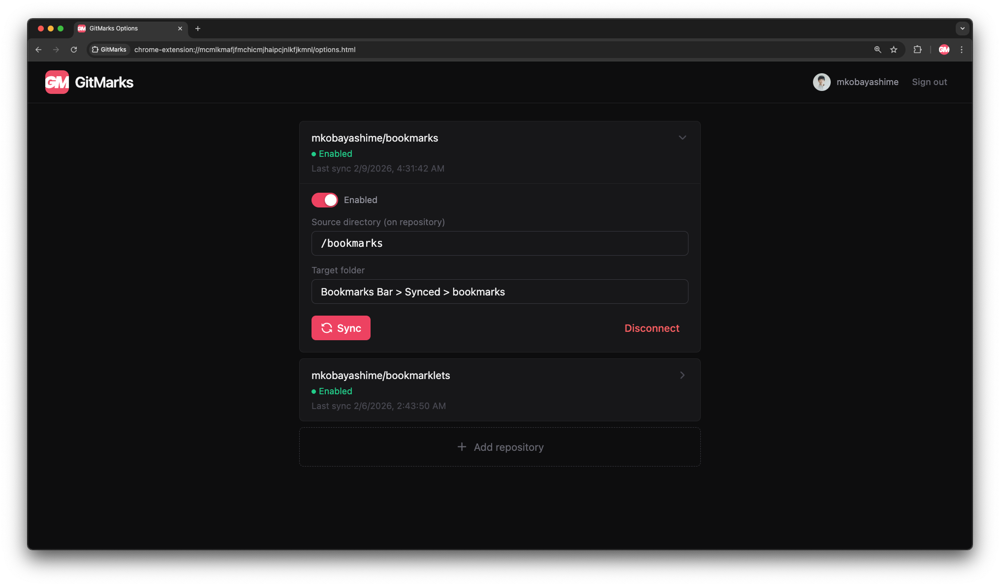

<div align='center'>


# GitMarks

Keep your Chrome bookmarks in sync with GitHub. One-way sync from your repos to your browser.

<br />

<div>
    <a href='https://chromewebstore.google.com/detail/gitmarks/omobppnblncamhlkhmbfalidcaoemfdj' target='_blank'>
        
    </a>
</div>
<a href='https://chromewebstore.google.com/detail/gitmarks/omobppnblncamhlkhmbfalidcaoemfdj' target='_blank'>
Chrome Web Store
</a>
</div>

<br />



## Features

- Connect your GitHub account and select repositories to sync
- Define bookmarks in `manifest.json` within your repo
- Supports both URLs and bookmarklet files
- Automatic periodic sync (configurable interval) + manual sync
- Skip-if-unchanged optimization using commit hash

## Setup

### 1. GitHub Repository

Create a `manifest.json` in your repository.


#### Manifest

- Schema: `Array<{ name: string; location: string; }>`
- `location` can be a URL or a relative path to a bookmarklet file in the same directory

> [!TIP]
> You can place multiple manifest files in subdirectories, and each will create a corresponding bookmark folder.

#### Example manifest

```json
[
  {
    "name": "Example URL",
    "location": "https://example.com"
  },
  {
    "name": "My Bookmarklet",
    "location": "./my-bookmarklet.js"
  }
]
```

#### Repository structure example with nested manifests

```
my-repo/
├── bookmarks/
│   ├── manifest.json      # -> TargetFolder/
│   ├── my-bookmarklet.js  # should be referenced in the manifest.json above
│   └── tools/
│       └── manifest.json  # -> TargetFolder/tools/
└── README.md
```

### 2. Extension Configuration

1. Install GitMarks and open the options page
2. Create a [Fine-grained Personal Access Token](https://github.com/settings/personal-access-tokens/new) on GitHub
   - **Repository access**: Select the repositories you want to sync
   - **Repository permissions**: Contents → Read-only
3. Sign in by entering your token in the GitMarks options page
4. Click "Add Connection" and select a repository
5. Configure:
   - **Source Directory**: Path to the directory containing `manifest.json` files (e.g., `/bookmarks`)
   - **Target Folder**: Chrome bookmark folder where bookmarks will be synced
     - Target folders for different connections must not overlap (no ancestor/descendant relationships)

## Usage

- **Automatic Sync**: Enabled connections sync periodically
- **Manual Sync**: Click "Pull" on any connection to sync immediately
- **Toggle**: Enable/disable connections without deleting configuration
- **Disconnect**: Remove a connection entirely

## Development

```bash
make deps # Install dependencies
make dev # Start dev server
make typecheck # Type checking
make lint.fix # Linting
```
